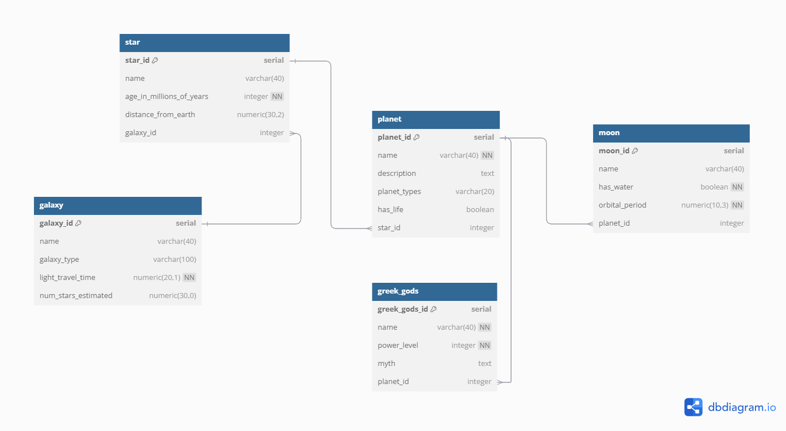

# Build a Celestial Bodies Database

* This is the [first project](https://www.freecodecamp.org/learn/relational-database/build-a-celestial-bodies-database-project/build-a-celestial-bodies-database) for the Relational Database certification from freeCodeCamp.
* In this project, I practiced essential skills for working with relational databases using the command-line tool `psql`. 
* The tasks included using basic SQL commands, internal psql commands (meta-commands), and learning how to dump a database.

I created a database with 5 tables:
- `galaxy`
- `star`
- `planet`
- `moon`
- `greek_gods` 

The first four tables were predefined by the project requirements, and I added the `greek_gods` table as an extra one.

--- 
## Entity Relationship Diagram
I used [dbdiagram.io](https://dbdiagram.io/home) to create an Entity Relationship Diagram for the database structure. 
You can find the `plaintext` code for the ERD diagram in the files attached.

